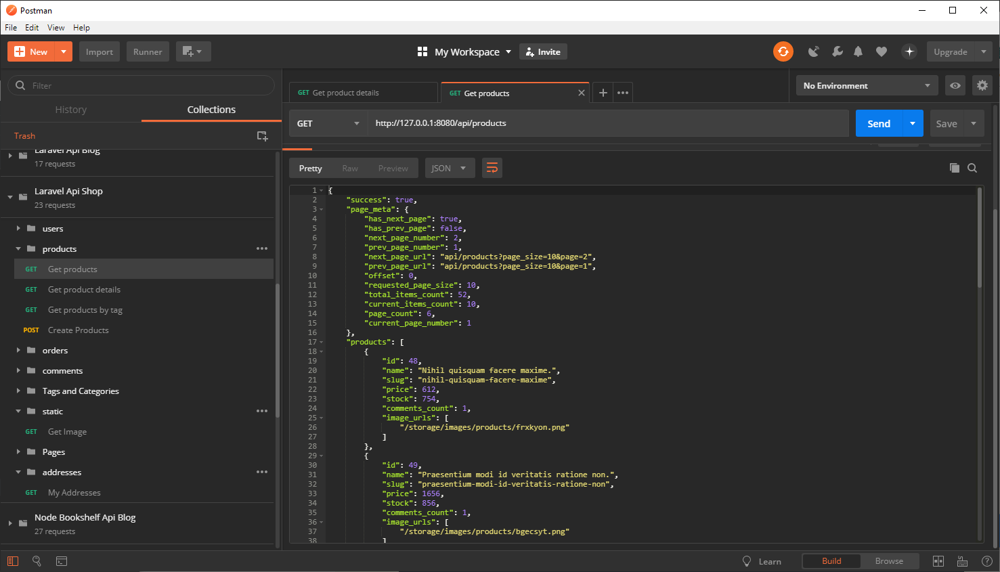
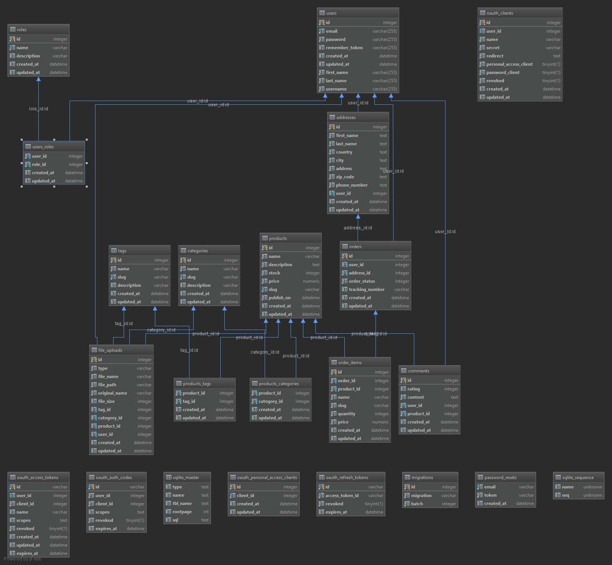

# Introduction
This is one of my E-commerce API app implementations. It is written in Php using Laravel framework.
This is not a finished project by any means, but it has a valid enough shape to be git cloned and studied if you are interested in this topic.
If you are interested in this project take a look at my other server API implementations I have made with:

- [Node Js + Sequelize](https://github.com/melardev/ApiEcomSequelizeExpress)
- [Node Js + Bookshelf](https://github.com/melardev/ApiEcomBookshelfExpress)
- [Node Js + Mongoose](https://github.com/melardev/ApiEcomMongooseExpress)
- [Python Django](https://github.com/melardev/DjangoRestShopApy)
- [Python Flask]()
- [Golang go gonic](https://github.com/melardev/api_shop_gonic)
- [Java EE Spring Boot and Hibernate](https://github.com/melardev/SBootApiEcomMVCHibernate)
- [Ruby on Rails](https://github.com/melardev/RailsApiEcommerce)
- [AspNet Core](https://github.com/melardev/ApiAspCoreEcommerce)

The next projects to come will be:
- Elixir with phoenix and Ecto
- AspNet MVC 6
- Java EE with Jax RS with jersey
- Java EE with Apache Struts 2
- Spring Boot with Kotlin
- Go with Gorilla and Gorm
- Go with Beego
- Laravel with Fractal and Api Resources
- Flask with other Rest Api frameworks such as Flask-Restful, flask-apispec
- NodeJs with Knex (without Bookshelf, this one is already done, see above links)

# Getting started
1. Git clone the project
1. Rename .env.example to .env and change the values as needed
1. Migrate
`php artisan migrate`
1. Seed the database
`php artisan db:seed`
1. Launch with php artisan serve --port=8080
1. Import api.postman.json into postman and begin issuing requests 

# What you will learn
- Laravel
    - Middlewares
    - Authentication
    - Authorization
- Eloquent ORM
    - associations: hasMany, belongsTo, belongsToMany
    - scopes
    - complex queries
    - paging
    - eager loading, select columns
    
# Features
- Authentication / Authorization
- Paging
- Products, Orders, OrderItems, Addresses, Custom User model, Tags, Categories, Comments, TimestampedModel, FileUpload(Polymorphic)
- Products associated to images, file upload without any 3party package
- CRUD operations on products, comments, tags, categories

- Orders, guest users may place an order

# Useful Artisan commands
`composer dump-autoload`
`php artisan migrate:reset`
`php artisan migrate`
`php artisan migrate:refresh --seed`
`php artisan help make:model`
- Scaffold with -a option: migration, controller and model
`php artisan make:model Model/Product -a`
`php artisan route:list`` `
`php artisan make:migrate`

    
# Todo
- Improve the seeding logic, there are orders with no order item.
- Security, File upload validations
- Unit testing
- Improve performance, improve database queries, they are fetching just everything now

# Steps
- Set a link from public/storage to storage, that way uploaded files can be accessible
`php artisan storage:link`

- This is needed for the migration rename_name_column where I rename name to username
`composer require doctrine/dbal`